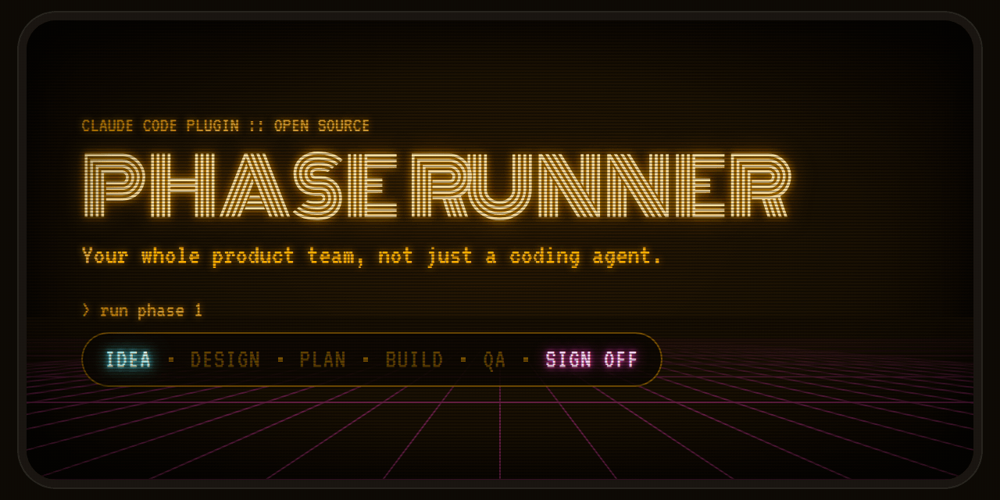

<p align="center">
  
</p>

# Phase Runner

**Your whole product team, not just a coding agent.**

Plan → design → build → QA, with you as the PM who signs off.

Phase Runner is a set of Claude skills that takes a product from a rough idea to shipped code. It plans the work as phases and sprints, locks a design system before any code gets written, builds in parallel waves, and runs independent verification and browser QA on every wave. You approve at the checkpoints; the agents do the loop in between.

## Install

Two commands in Claude Code:

```
/plugin marketplace add AyeJK/phase-runner
/plugin install phase-runner@phase-runner
```

Skills load as `phase-runner:phase-planner`, `phase-runner:phase-builder`, and so on.

The HUD for Claude Code, a status line and toasts while a phase runs, is a separate install: see [Optional: HUD mod](#optional-hud-mod).

## How it works

<p align="center">
  
</p>

1. **Plan the product.** Starting something new? Tell `product-planner` what you want to build. It turns the idea into a product plan: the options, how the data flows, and the open questions to settle. In a Claude app session the plan also publishes as [an artifact](#optional-claude-artifacts).
2. **Design it.** Run `design-planner` to lock in a design system and get HTML mockups of every screen before any code is written. In a Claude app session both also publish as [artifacts](#optional-claude-artifacts).
3. **Break it into phases.** Ask `phase-planner` to turn the product plan, design system and mockups into phase plans, split into sprints and tasks, each with acceptance criteria.
4. **Build it.** With the docs in place, say something like *"implement phase 1"*. `phase-builder` gets to work, and checks in with you when it hits a blocker or finishes the phase.

Step 4 runs on its own. `phase-builder` groups sprints into parallel-safe waves and gives each sprint a fresh sub-agent, and UI sprints build against your design system. After every wave, `phase-verify` runs your build, typecheck and tests and reviews the diff against every acceptance criterion, and `phase-wave-test` checks UI work in a browser against your design system. A failed wave retries the same sprint with the failure attached, up to three times, then escalates to you. Only `phase-doc-sync` writes status back to the phase file, so the plan always matches what actually passed. Nothing ships past you.

## Local dashboard

[`phase-viewer`](viewer/) is a local dashboard for tracking your phases, sprints and tasks. Monitor your phase builds, wave progress, verification failures and anything that needs your attention. It updates as the files change, and it only reads your project, never writes to it.

<p align="center">
  
</p>

<sub>A simulated run, replayed from a run log: Phase 2 of this repo's own build, with the failures, the blocker and the per-task progress added for the demo.</sub>

**Live task progress.** Open a sprint while it's being implemented and its tasks table follows the implementer: a task reads Running when the implementer starts it and Built when it finishes it. Built means the code for that task is written and no gate has checked it yet. Once the sprint has passed its gates and doc sync has run, each row shows its status from the phase file, such as Complete. Only the rows change: task counts, status bars and the sprint's state still come from the phase file and the gate results. A run log from a plugin version that didn't log each task shows the phase file's statuses, as before.

In Claude Code, say *"open the viewer"*. The `phase-viewer` skill starts it in the background and gives you the URL. Ask again later and you get the same URL, since only one viewer runs per project.

Or, from your project folder (the one that holds `docs/phases/`), in your own terminal:

```
npx phase-viewer
```

Open the URL it prints. Ctrl+C stops it. Needs Node.js 20 or later.

**Local sessions only.** The viewer serves on `localhost` of the machine that runs it. In a cloud or remote Claude Code session, the skill starts nothing and tells you to run `npx phase-viewer` on your own machine, against your local checkout.

**Keep run logs out of git.** `phase-builder`'s agents append JSON lines to `docs/phases/.runs/`: one per gate result, one as each sprint's implementation starts, and one as each task starts and finishes. The viewer reads these logs, but they only make sense on the machine that ran the build, so add this to your `.gitignore`:

```gitignore
docs/phases/.runs/
```

## Optional: HUD mod

[`phase-runner-hud`](hud/) is a second, optional plugin for Claude Code. It adds three things:

- **A status line** while a phase runs. `P8 · wave 2 · 8.3 verify 2/3` is phase 8, wave 2, Sprint 8.3, in verify, attempt 2 of 3. It follows the run log, so it changes within about 2 seconds of each gate result.
- **A toast** each time a run stops for you: an escalation (a gate failed on its last allowed attempt), a blocker (an implementer reported a blocked task), or the phase completing.
- **`/phase-status`**, which prints the phase, how many tasks each sprint has done, the current wave and gate, and when the last event was logged. The mod answers it from the files on disk, with no model call and no tokens.

```
/plugin install phase-runner-hud@phase-runner
```

Then start a new session from your project folder, the one that holds `docs/phases/`. It has two options, both in `/config`: `workspace`, for when `docs/phases/` isn't in the session's folder, and `sound`, a short chime with each toast (off by default). [`hud/README.md`](hud/README.md) has the details.

It only reads `docs/phases/` and its run logs. It's a Claude Code mod, built on an early-access API that can change between releases, so it's kept apart from the main plugin: nothing in Phase Runner depends on it, and in Cursor or any other host the skills run as they always have.

## Optional: Claude artifacts

In a Claude app session, the two planning skills also publish what they write as Claude artifacts: hosted copies you can share and review.

| Skill | From the files | Published as |
|---|---|---|
| `product-planner` | `docs/Plan-{Name}-{date}.html` | The plan as a hosted page |
| `design-planner` | `docs/design/DESIGN.md` and `design-system.md` | A Design System artifact: the tokens, with `design-system.md` as its README |
| `design-planner` | `docs/design/screens/*.html` | One Design canvas, with an artboard per mockup, using the project's Design System artifact for its tokens |

The files in `docs/` stay the contract. An artifact is a copy of them: every change goes into the files first and is then republished, and `phase-planner`, the implementers and the gates read `docs/`, never an artifact. Each file records its artifact's URL (the plan in a `<meta>` tag, the design system and the canvas in `DESIGN.md`'s header), so a later run revises the same artifact and never creates a second one.

Reviewers comment on the published design system and canvas, and `design-planner` has two operations that bring the review back into the files:

- **"Apply review"** reads the open comments on the design system and the canvas, makes each change in the files, republishes, and replies on each thread with what changed. A comment on an artboard changes that screen's spec and its HTML mockup.
- **"Pull edits"** is for a change someone made on the design system's page itself, to a token or the README. It shows you the difference from the files and writes nothing until you say yes. It covers the design system only. An artboard edited on the canvas is never overwritten without asking, and a change you want to keep goes into the screen spec and the mockup by hand.

Nothing requires the Artifact tool. In a session without it, the skills write the same files and skip the publish, and a publish that fails is reported without stopping the skill. [Platform support](#platform-support) lists what each artifact needs.

## How it compares

| | Phase Runner | [Superpowers](https://github.com/obra/superpowers) | [Spec Kit](https://github.com/github/spec-kit) | [GSD](https://github.com/open-gsd/gsd-core) | [BMAD](https://github.com/bmad-code-org/BMAD-METHOD) |
|---|---|---|---|---|---|
| **Idea → product plan** | ✅ | ✅ | ✅ | ✅ | ✅ |
| **Design system before code** | ✅ with HTML mockups | ❌ | ❌ | ✅ UI contract + HTML sketches | ✅ UX spec |
| **Parallel build** | ✅ waves | ❌ sequential by design | — | ✅ waves | — |
| **A separate agent reviews the work** | ✅ every wave | ✅ every task | ❌ the implementer checks its own work | 🟡 on demand | 🟡 on demand |
| **Automatic retry on failure** | ✅ up to 3, then you | ✅ up to 5 rounds | 🟡 you repeat implement → converge | 🟡 on demand | — |
| **Browser QA on UI work** | ✅ every UI wave | ❌ | ❌ | 🟡 on demand, with a browser MCP | 🟡 generates E2E tests |
| **Live dashboard of the build** | ✅ [`phase-viewer`](viewer/), in your browser, plus an optional [status line](#optional-hud-mod) in Claude Code | ❌ a progress file | ❌ third-party TUI only | 🟡 text status in chat | 🟡 text status in chat |

✅ built into the workflow · 🟡 a command you run · ❌ not included · — not documented

Most of these pieces exist somewhere. Phase Runner is the one where all of them run on their own, on every wave, inside the build loop.

<sub>Checked against each project's README and docs on Sep 27, 2026, and the dashboard row on Sep 30, 2026. Phase Runner's cell in that row was rechecked against `viewer/` and `hud/` on Oct 3, 2026. Spot something out of date? Open an issue.</sub>

## Receipts

[`phase-viewer`](viewer/) was built with Phase Runner: 7 phases, 26 sprints. Sprints 1.1 to 1.3 added the run log itself, so the log picks up at 1.4 and covers the other 23. Here's what it recorded:

- **84 gate results** across implement, verify, wave-test and doc-sync
- **3 verify failures, on 2 sprints.** Both were fixed by automatic retries, with no help needed
- **5 verify partials.** Nothing failed, but a note went on record and the wave moved on
- **9 browser wave-tests**, all passed
- **1 escalation**, where the run stopped and asked for a human

What verify caught:

- **Sprint 4.2.** Attempt 1 failed `npm run check`: the new browser test used `window` and `document`, but the project's TypeScript config has no DOM types. Attempt 2 fixed that, then failed again, because at 375px wide every page scrolled sideways by 168px. Attempt 3 fixed the overflow and passed.
- **Sprint 5.3.** Attempt 1 failed typecheck: a test imported a chain of files that reached a `.tsx` component, and the root TypeScript build isn't set up for JSX. Attempt 2 moved the shared helper into a plain `.ts` file and passed.

The partials were either criteria that verify couldn't check from the command line, such as ones needing a real plugin install (3 sprints), or all criteria met with a note attached, such as files changed outside the sprint's Module column (2 sprints). The escalation was Sprint 7.5, whose last task needed a plugin install and a live phase run on a real machine.

<sub>Counted from `docs/phases/.runs/` on Sep 29, 2026. Run logs are gitignored, so this section is the published record.</sub>

## What's in here

### Skills you use

These are the five you talk to. Everything else runs on its own.

| Skill | Job |
|---|---|
| `product-planner` | Turns a rough idea into a rich HTML plan doc — options considered, data flow, open questions. Optional first step. In Claude app sessions it also publishes the plan as a hosted page ([Claude artifacts](#optional-claude-artifacts)). |
| `design-planner` | Locks a visual design system and per-screen specs *before* implementation starts. In Claude app sessions it also publishes a Design System artifact and a Design canvas, with "Apply review" and "Pull edits" to bring review back into the files ([Claude artifacts](#optional-claude-artifacts)). |
| `phase-planner` | Creates and edits `docs/phases/Phase-*.md` files — the sprint/task source of truth. |
| `phase-builder` | The orchestrator. Reads a phase file, groups sprints into parallel-safe waves, spawns implementation sub-agents, and won't advance a wave until it passes verification. |
| `phase-viewer` | Starts the live dashboard (`npx phase-viewer`) in the background and gives you its URL. Local sessions only. |

### Skills phase-builder runs for you

You normally don't call these. `phase-builder` spawns each one as a sub-agent during a run, with its own narrow job and a structured result it has to hand back.

| Skill | Job |
|---|---|
| `phase-ui-implement` | Builds UI sprints. Reads your `design-system.md` first, generic UI-pattern skills second. |
| `phase-verify` | Runs your build/test/typecheck command, then reviews the wave's diff: a met/not-met verdict with evidence for every acceptance criterion, a check that no test was deleted or weakened, and a check that changes stay inside each sprint's Module column. Serious findings fail the wave and trigger a retry. |
| `phase-wave-test` | Browser and UI checks on UI sprints, against your project's `design-system.md` if one exists. |
| `phase-doc-sync` | The *only* thing allowed to write status changes back into the phase file. Batches edits, never touches acceptance criteria or task text. |

`phase-runner-hud` isn't in either table because it isn't a skill. It's a separate, optional plugin: see [Optional: HUD mod](#optional-hud-mod).

## Why sub-agents, and why the strict handoff order

The orchestrator (`phase-builder`) never writes code, never runs your test suite, and never edits the phase file directly. Every one of those actions happens in a sub-agent with a narrow, single-purpose prompt, and the orchestrator only advances after reading back a structured result block (`SPRINT RESULT`, `VERIFY RESULT`, `WAVE TEST RESULT`, `DOC SYNC RESULT`). This is deliberate:

- **The orchestrator thread stays cheap and legible.** No command output, no tool logs — just one-line status per gate. You can read what happened in a long run without wading through build logs.
- **Nothing is "done" because an agent said so.** Verify and wave-test are separate passes with their own pass/fail contract. Implementation can't grade its own homework.
- **The phase file can't drift.** Only doc-sync writes to it, and only after every gate for that wave has actually passed. The viewer's [live task progress](#local-dashboard) comes from the run log, so the phase file is still written only by doc-sync.
- **Retries retry the same unit of work**, not a patched-together "fix" task with no scope boundary. A failed sprint gets re-spawned with the failure injected — same sprint ID, same acceptance criteria, `(retry n)` in the description.

## The folder convention

```
your-project/
├── docs/
│   ├── phases/
│   │   ├── Phase-1-Foundation.md
│   │   ├── Phase-2-Core-Feature.md
│   │   └── ...
│   └── design/                    (written by design-planner)
│       ├── DESIGN.md
│       ├── design-system.md
│       └── screens/
│           ├── index.html
│           └── {screen}.md + {screen}.html
└── app/                           (or wherever your actual code lives)
    ├── package.json / pyproject.toml / Cargo.toml / go.mod
    └── src/
```

Two roots matter and phase-builder resolves both automatically at the start of every run (see `plugin/skills/phase-builder/project-layout.md`):

- **workspace_root** — where `docs/` lives
- **app_root** — where your code and its manifest file live

Small projects often have these be the same folder. Larger ones split them — useful when you want the phase history to survive a full rewrite of the app itself.

You don't need to create these folders. `phase-planner` and `design-planner` make them the first time they run.

## Platform support

This kit was originally built against Cursor's skill/sub-agent conventions and has been generalized to run on any Claude Code–compatible agent runtime (Cursor, Claude Code, or hosts built on the Claude Agent SDK). The only environment-specific pieces — which tool spawns a sub-agent, what type name to give it, and how skill files get loaded — are resolved once per run by `plugin/skills/phase-builder/runtime-adapter.md`, which discovers what's actually available in your session rather than assuming a specific tool. See that file if you're adding support for a new environment.

What each piece needs:

| Piece | Needs |
|---|---|
| The skills | Any supported host: Cursor, Claude Code, or a host built on the Claude Agent SDK |
| [Claude artifacts](#optional-claude-artifacts) | A Claude app session whose Artifact tool is present. `design-planner`'s two also need that tool to list the Design System type (for the design system) and the Design type (for the canvas) |
| [HUD mod](#optional-hud-mod) | Claude Code: the terminal or the desktop app's Code tab |
| [`phase-viewer`](#local-dashboard) | Node.js 20 or later, on your own machine |

The skills need neither the Artifact tool nor the HUD. Without the Artifact tool the publish is skipped, without the HUD there's no status line, and everything else runs the same.

## Optional dependencies

`phase-ui-implement` and `design-planner` will use a generic UI-component-pattern skill and a frontend-design-direction skill *if you have one installed* — they're not bundled here, since good ones are often licensed separately (for example, Anthropic ships example skills like this with its own products). Nothing in this kit requires them; without one, implementation falls back to matching your project's existing components and, absent that, standard accessible-UI defaults. If you have such a skill installed under a name your environment can discover, `skill-router.md` will pick it up automatically.

## Status conventions

| Symbol | Meaning |
|---|---|
| `—` | Not started |
| `~` | In progress |
| `x` | Completed |
| `BLOCKED` | Blocked by dependency or issue |
| `MANUAL` | Yours to do: publish, install on your machine, record, anything outside the codebase |
| `CUT` | Removed from scope (row preserved for history) |
| `DEFERRED` | Pushed to a later sprint or phase |

`BLOCKED` and `MANUAL` both need you, in different ways. A `BLOCKED` task is agent work that got stuck: `phase-builder` stops and asks, and an agent finishes it once you unblock it. A `MANUAL` task never goes to an agent and never stops the run. `phase-builder` lists it at the phase checkpoint, and you mark it `x` when you've done it.

Only `phase-doc-sync` writes these during an automated run. You can obviously edit the file by hand any time outside a run, or just ask `phase-planner` to make the change conversationally.

## License

MIT — see [LICENSE](LICENSE).
